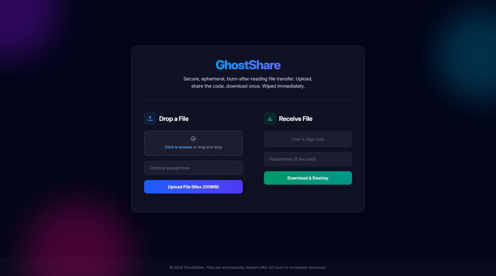

# 👻 GhostShare

 **GhostShare** is a secure, ephemeral, "burn-after-reading" file transfer service.

Need to send a sensitive file, document, or archive without it living on a server or in an email chain forever? GhostShare allows you to upload a file, lock it with an optional passphrase, and generate a secure 6-digit redemption code. The moment the recipient downloads the file, it is permanently destroyed from the server.

**Live Demo:** [https://ghostshare.anis.page](https://ghostshare.anis.page)

---

## ✨ Features

* **Burn-After-Reading:** Files are instantly and permanently deleted from the disk and database the exact second the download completes.
* **Auto-Expiration (TTL):** If a file is not downloaded within 24 hours, a background cron job securely wipes it.
* **Generous Limits:** Upload files up to 200MB.
* **Passphrase Protection:** Add an optional layer of security with a custom password required for decryption.
* **Sleek UI:** Modern, responsive glassmorphism design featuring seamless drag-and-drop functionality.

---

## 🛠️ Tech Stack

**Frontend:**
* HTML5 / Vanilla JavaScript
* Tailwind CSS v4 (Compiled via PostCSS)

**Backend:**
* Node.js & Express.js
* Multer (for handling multipart/form-data uploads)
* Better-SQLite3 (for fast, ephemeral, in-memory-like data storage)

**Infrastructure (Production):**
* Ubuntu Linux VM
* Nginx (Reverse proxy & SSL)
* PM2 (Daemon process manager)
* Let's Encrypt / Certbot (Automated SSL certificates)

---

## 🚀 Local Development Setup

Want to run GhostShare on your own machine? It's incredibly simple.

### Prerequisites
* Node.js (v18 or higher)
* Git

### Installation

1. **Clone the repository:**
   ```bash
   git clone [https://github.com/yourusername/ghostshare.git](https://github.com/yourusername/ghostshare.git)
   cd ghostshare
    ```

2. **Install dependencies:**
    ```bash
    npm install
    ```

3. **Build the CSS:**

   (Since the compiled Tailwind CSS is ignored by Git, you must build it locally).
    ```bash
    npm run build:css
    ```

4. **Start the server:**
    ```bash
    npm start
    ```

5. **Open your browser:**

   Navigate to http://localhost:3000 to see the app running locally!
---

## 📁 Project Structure
```
ghostshare/
├── public/               # Static assets (HTML, generated CSS)
├── src/                  # Source files (Tailwind input CSS)
├── uploads/              # Temporary storage for uploaded files (git-ignored)
├── package.json          # Dependencies and npm scripts
├── server.js             # Express application and SQLite logic
└── .gitignore            # Keeps the database and uploads out of source control
```
---

## 🔒 Security Notes
GhostShare relies on SQLite for metadata storage and the local filesystem for temporary blobs. It is designed to be self-hosted. Because the database files (files.db, files.db-shm, files.db-wal) contain active redemption codes and password hashes, they are strictly excluded from version control.

---

# 🤝 Contributing
Contributions, issues, and feature requests are welcome! Feel free to check the [issues page](https://github.com/AgentPhoenix7/GhostShare/issues).